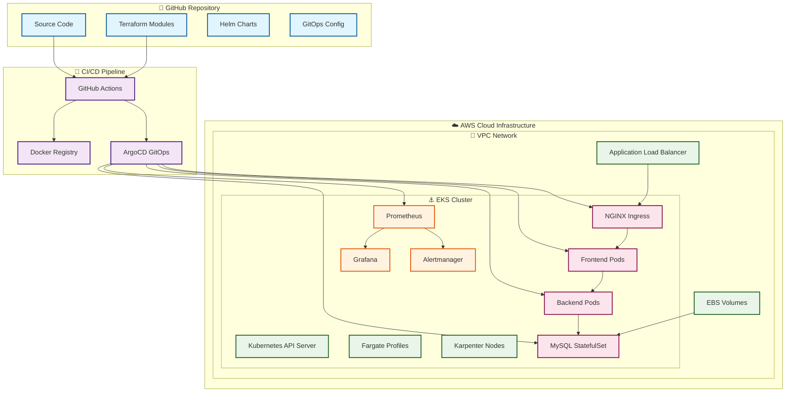

# 🖥️ PC Parts Cloud-Native Platform

[](https://aws.amazon.com/)
[](https://kubernetes.io/)
[](https://terraform.io/)
[](https://docker.com/)
[](https://github.com/features/actions)

> **My First DevOps Project** - A comprehensive cloud-native application showcasing enterprise-grade DevOps practices, from infrastructure provisioning to continuous deployment and monitoring.

---

## 🎯 Project Overview

This full-stack PC parts ordering platform represents my journey from DevOps beginner to practitioner. Built as a learning project, it demonstrates real-world implementation of modern cloud-native technologies and industry best practices that I mastered throughout my DevOps learning path.

### 🌟 What Makes This Project Special

- **Complete Infrastructure Automation**: Everything provisioned as code
- **Production-Ready Architecture**: Scalable, secure, and observable
- **GitOps Methodology**: Declarative, version-controlled deployments
- **Enterprise Monitoring**: Full observability stack with alerting
- **Security First**: IAM, RBAC, and cloud security best practices

---

## 🚀 Key Features

### 🏗️ **Infrastructure & Platform**
- **Infrastructure as Code**: Complete AWS infrastructure (VPC, EKS, IAM, networking) using modular Terraform
- **Kubernetes Orchestration**: Production-grade EKS cluster with Fargate profiles and Karpenter autoscaling
- **GitOps Deployment**: ArgoCD managing all deployments using App of Apps pattern
- **Dynamic Scaling**: Karpenter for intelligent node provisioning and cost optimization

### 🔄 **CI/CD & Automation**
- **Automated Pipelines**: GitHub Actions for Docker builds and Helm chart updates
- **Multi-stage Docker Builds**: Optimized container images with security scanning
- **Helm Chart Management**: Custom charts for streamlined Kubernetes deployments
- **Zero-Downtime Deployments**: Rolling updates with health checks

### 📊 **Observability & Monitoring**
- **Metrics Collection**: Prometheus for comprehensive cluster and application monitoring
- **Visualization**: Grafana dashboards for real-time insights and analytics
- **Alerting**: Alertmanager for proactive issue detection and notification
- **Log Aggregation**: Centralized logging for troubleshooting and audit trails

### 🔐 **Security & Networking**
- **Network Security**: Custom VPC with private/public subnet architecture
- **Access Control**: RBAC implementation for granular permissions
- **Load Balancing**: NGINX Ingress Controller for intelligent traffic routing
- **Storage Security**: Encrypted EBS volumes with CSI driver integration

---

## 🛠️ Technology Stack

<table>
<tr>
<td width="50%">

### **Cloud & Infrastructure**
- **☁️ AWS**: EKS, VPC, IAM, EBS, ALB
- **🏗️ Terraform**: Modular IaC architecture
- **⚓ Kubernetes**: Container orchestration
- **🎯 Karpenter**: Intelligent autoscaling

### **CI/CD & GitOps**
- **🔄 GitHub Actions**: Automated pipelines
- **🎯 ArgoCD**: GitOps deployments
- **📦 Docker**: Containerization
- **⚙️ Helm**: Package management

</td>
<td width="50%">

### **Monitoring & Observability**
- **📊 Prometheus**: Metrics collection
- **📈 Grafana**: Data visualization
- **🚨 Alertmanager**: Alert routing
- **🔍 Reloader**: Configuration management

### **Application Stack**
- **🟢 Node.js**: Backend API (Express)
- **🌐 HTML/CSS/JS**: Frontend interface
- **🗄️ MySQL**: Persistent database
- **🔧 NGINX**: Reverse proxy & ingress

</td>
</tr>
</table>

---

## 🏗️ Architecture Overview



---

## 📁 Project Structure

```
firstapp/
├── 🏗️ terraform/                    # Root Infrastructure as Code
│   ├── main.tf                     # Main Terraform configuration
│   ├── variables.tf                # Input variables
│   ├── outputs.tf                  # Output values
│   ├── app-of-apps.yaml           # ArgoCD App of Apps configuration
│   ├── karpenter.yaml             # Karpenter autoscaler setup
│   ├── nodepool.yaml              # Node pool configuration
│   └── values.yaml                 # Helm values
│
├── 🧩 terraform-modules/            # Reusable Infrastructure Modules
│   ├── vpc-module/                 # VPC networking module
│   │   ├── main.tf
│   │   ├── variables.tf
│   │   └── outputs.tf
│   └── eks-module/                 # EKS cluster module
│       ├── main.tf
│       ├── variables.tf
│       └── outputs.tf
│
├── 🎯 apps/                         # ArgoCD GitOps Applications
│   ├── ingress.yaml               # NGINX Ingress Controller app
│   ├── kubepromstack.yaml         # Prometheus monitoring stack
│   ├── myapp.yaml                 # PC Parts application
│   └── reloader.yaml              # Configuration reloader
│
├── 💻 myapplication/                # Application Source Code
│   ├── Backend/                    # Node.js Express API
│   │   ├── server.js
│   │   ├── package.json
│   │   ├── routes/
│   │   └── models/
│   ├── Frontend/                   # Static web interface
│   │   ├── index.html
│   │   ├── styles.css
│   │   ├── script.js
│   │   └── assets/
│   └── chart/                      # Custom Helm chart
│       ├── Chart.yaml
│       ├── values.yaml
│       └── templates/
│
└── 🔄 .github/workflows/            # CI/CD Pipeline Definitions
    ├── backend-cicd.yml            # Backend build & deploy
    ├── frontend-cicd.yml           # Frontend build & deploy
    └── infrastructure.yml          # Infrastructure updates
```

---

## 🚀 Getting Started

### 📋 Prerequisites

Ensure you have the following tools installed:

```bash
# Required tools
- AWS CLI (v2.x)
- Terraform (>= 1.0)
- kubectl (>= 1.24)
- Helm (>= 3.x)
- Docker (>= 20.x)
- Git
```

### ⚡ Quick Deployment

1. **Clone the repository**
   ```bash
   git clone https://github.com/cosmin1230/Firstapp.git
   cd Firstapp
   ```

2. **Configure AWS credentials**
   ```bash
   aws configure
   # Or use environment variables:
   export AWS_ACCESS_KEY_ID="your-access-key"
   export AWS_SECRET_ACCESS_KEY="your-secret-key"
   export AWS_DEFAULT_REGION="us-west-2"
   ```

3. **Deploy infrastructure**
   ```bash
   cd terraform
   terraform init
   terraform plan
   terraform apply -auto-approve
   ```

4. **Access your services**
   ```bash
   # Get cluster credentials
   aws eks update-kubeconfig --region us-west-2 --name pc-parts-cluster
   
   # Port forward to ArgoCD (if not using LoadBalancer)
   kubectl port-forward svc/argocd-server -n argocd 8080:443
   
   # Access Grafana dashboards
   kubectl port-forward svc/prometheus-grafana -n monitoring 3000:80
   ```

---

## 📊 Monitoring & Observability

### 🎯 **Key Metrics Tracked**
- **Cluster Health**: Node status, pod health, resource utilization
- **Application Performance**: Response times, error rates, throughput
- **Infrastructure Costs**: Resource consumption and optimization opportunities
- **Security Events**: Access patterns, failed authentications, policy violations

### 📈 **Available Dashboards**
- **Kubernetes Overview**: Cluster-wide resource utilization and health
- **Node Monitoring**: Individual node performance and capacity
- **Application Metrics**: Custom business logic and user experience metrics
- **Cost Analysis**: Resource usage patterns and optimization recommendations

---

## 🎓 DevOps Skills Demonstrated

<table>
<tr>
<td width="50%">

### **🏗️ Infrastructure & Cloud**
- ✅ AWS cloud architecture design
- ✅ VPC networking and security groups
- ✅ EKS cluster management and scaling
- ✅ IAM roles and security policies
- ✅ Infrastructure as Code with Terraform
- ✅ Modular and reusable IaC patterns

### **⚓ Container Orchestration**
- ✅ Kubernetes cluster administration
- ✅ Pod scheduling and resource management
- ✅ StatefulSets for persistent workloads
- ✅ ConfigMaps and Secrets management
- ✅ RBAC and security policies
- ✅ Ingress controllers and networking

</td>
<td width="50%">

### **🔄 CI/CD & Automation**
- ✅ GitHub Actions pipeline design
- ✅ Multi-stage Docker builds
- ✅ Container registry management
- ✅ GitOps deployment strategies
- ✅ Automated testing and validation
- ✅ Blue-green and rolling deployments

### **📊 Monitoring & Observability**
- ✅ Prometheus metrics collection
- ✅ Grafana dashboard creation
- ✅ Alert rule configuration
- ✅ Log aggregation and analysis
- ✅ Performance monitoring
- ✅ Cost optimization tracking

</td>
</tr>
</table>

---

## 🔮 Future Enhancements

- [ ] **Service Mesh**: Implement Istio for advanced traffic management
- [ ] **Security Scanning**: Integrate container vulnerability scanning
- [ ] **Multi-Environment**: Staging and production environment separation  
- [ ] **Backup Strategy**: Automated database backups to S3
- [ ] **Cost Optimization**: Spot instances integration with Karpenter
- [ ] **Advanced Monitoring**: Distributed tracing with Jaeger

---

## 📝 Learning Journey

This project represents my progression through key DevOps concepts:

1. **Started with**: Basic containerization and local development
2. **Progressed to**: Cloud infrastructure and Kubernetes orchestration
3. **Advanced to**: GitOps, monitoring, and production-ready deployments
4. **Mastered**: End-to-end automation and observability practices

Each component was implemented iteratively, allowing me to understand both the individual technologies and how they integrate in a complete DevOps ecosystem.

---

## 📄 License

This project is licensed under the MIT License - see the [LICENSE](LICENSE) file for details.

---

## 👨‍💻 About the Author

**Cosmin** | Aspiring DevOps Engineer

- 🌱 **Currently Learning**: Advanced Kubernetes patterns, Service Mesh architectures
- 🎯 **Focus Areas**: Cloud-native technologies, Infrastructure automation, SRE practices
- 🔗 **GitHub**: [@cosmin1230](https://github.com/cosmin1230)
- 💡 **Passion**: Building scalable, automated, and observable systems

---

<div align="center">

**⭐ If you found this project helpful, please consider giving it a star!**

*This project showcases practical DevOps skills through real-world implementation of industry-standard tools and practices.*

</div>
